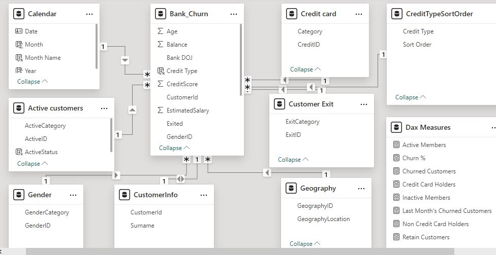

# Customer Churn Analysis

## Introduction
This Customer Churn Analysis was developed using **Power BI** to gain insights into the customer churn behavior of a bank. The goal was to identify key patterns of churn across various customer segments, such as credit types, gender, and geographic locations, and provide actionable recommendations for reducing churn and improving retention.

## Tools & Techniques Used
- **Tool:** Power BI
- **Data Source:** I utilized a fact table (Bank dataset) that contained transactional and customer data, as well as dimension tables for customer demographics, credit types, and location.
- **Data Modeling:** Relationships were established between the fact and dimension tables. A lookup (calendar) table was created for time intelligence, allowing the analysis of trends across months and years.

- **Data Transformation (Power Query):**
  - Removed irrelevant columns that were not essential for the analysis to optimize performance.
  - Checked for missing values and cleaned the data to ensure accuracy.
  - Created new columns to ensure the correct sorting of fields, such as months appearing in the correct order in visualizations.
- **DAX Measures:** I implemented DAX (Data Analysis Expressions) to create custom measures and calculated columns. For example, I used DAX to group customers by their credit type, enabling segmentation by credit quality (poor, fair, good, very good, excellent).

## DAX
- **_Active Members:_**

- **_Inactive Members:_**

- **_Churned Customers:_**

- **_Last Month's Churned Customers:_**

- **_Credit Card Holders:_**

- **_Non Credit Card Holders:_**

- **_Total Customers:_**

- **_Retain Customers:_**

- **_Churn %:_**

- **_Credit Type:_**

## Dashboard

## Key Insights and Observations
1. **High Churn Among Poor Credit Holders:** Customers with poor credit ratings exhibit higher churn rates compared to other credit groups. The trend indicates that those with lower financial health are more likely to leave, signaling the need for targeted retention programs for this group.

2. **Gender-Based Churn:** Females contribute slightly more to the churn percentage (55.92%) than males (44.08%). This could imply the need for gender-specific initiatives to improve retention, possibly by addressing factors that might resonate more with female customers.

3. **Fluctuating Churn Rates by Month:** A closer look at the monthly churn rate table shows significant churn spikes in April and July across the years. This suggests that these months are key periods when customers are most likely to leave, potentially due to service-related or seasonal factors.

4. **Credit Card Usage and Churn:** A large percentage of churned customers were non-credit card holders, indicating that credit card services might play a role in customer retention. Offering more tailored credit card products or incentives could help reduce churn among this segment.

5. **Time-Based Churn Increase:** The Total Customers by Year and Status chart shows a steady rise in inactive customers over the years, indicating increasing churn. Despite an overall increase in total customers, churn seems to be accelerating, particularly in 2018 and 2019.

## Recommendations
1. **Create Targeted Retention Programs for Customers with Poor Credit:** Since churn rates are highest among customers with poor credit, the bank should consider offering special programs, such as credit rehabilitation services or personalized financial management tools, to retain this segment.

2. **Gender-Specific Retention Campaigns:** With females showing higher churn rates, the bank could design tailored retention campaigns focused on addressing their specific needs. This could include product offerings that resonate more with female customers or providing personalized incentives based on customer preferences.

3. **Focus on Peak Churn Months:** The spike in churn rates during April and July suggests that there may be service or external factors affecting customer loyalty during these months. The bank should investigate the root causes and implement strategies such as promotional offers, improved customer support, or loyalty rewards during these high-risk periods.

4. **Enhance Credit Card Offerings:** As a significant portion of churned customers are non-credit card holders, offering incentives or improved services tailored to this group could increase retention. Additionally, personalized credit card offers or loyalty points for cardholders could further engage the existing customer base.

5. **Use Predictive Analytics for Proactive Retention:** With the data at hand, the bank could implement predictive churn models to identify customers who are most likely to churn. By preemptively reaching out to these customers with targeted retention strategies, the bank could reduce churn significantly.

## Conclusion
This Customer Churn Analysis provides valuable insights into customer behavior, highlighting key patterns related to churn and retention. By focusing on the most vulnerable customer segments, such as those with poor credit and female customers, and addressing churn during peak months, the bank can take proactive steps to reduce churn and improve customer loyalty.

The analysis showcases my ability to work with Power BI, perform effective data modeling, transform raw data into meaningful insights using DAX measures, and create visually compelling dashboards that drive decision-making. This project exemplifies the use of data analytics to solve real-world business problems and deliver actionable insights for better customer management.
